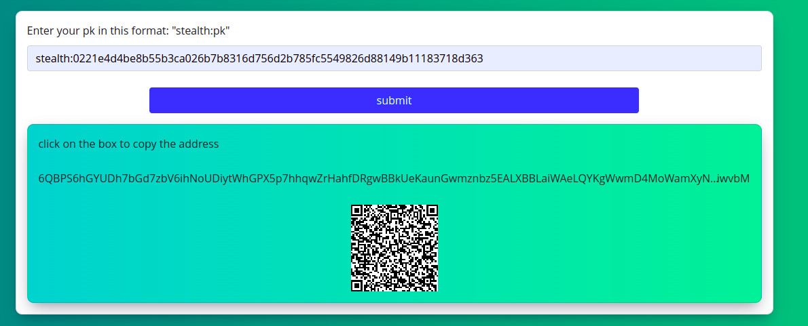

# Stealth Address Scanner

* In this project we customize the ergo scanner project to find adn store ergo boxes related to a stealth address.
*This project is based on Ergo blockchain scanner*

you can read the scanner main document in [here](https://github.com/ergoplatform/scanner#ergo-blockchain-scanner).

## What is Stealth Address

Acoding to Kushti: 
> Another solution for improving privacy is using stealth addresses. A stealth address preserves recipient privacy without per-transaction interaction needed (so receiver published an address e.g. on its website, and then sender can obtain some unique one-time address from it). This could be useful for privacy-preserving commerce, private donations and crowdfunding campaigns etc.

In other words, stealth adddress used when you want to hide your extact amount of entrance. you can pass a public key to people and they compile a stealth contract and send some Ergs to the contract address. On the other hand the reciever can prove the contract and collect the Ergs.

* If you whant to know more about the stealth address may be [this post](https://www.ergoforum.org/t/stealth-address-contract/255) be helpfull

We customize the stealth contract like this
 ```scala
  val stealthScript: String = {
    s"""{
       |  val gr = decodePoint(fromBase64("GR"))
       |  val gy = decodePoint(fromBase64("GY"))
       |  val ur = decodePoint(fromBase64("UR"))
       |  val uy = decodePoint(fromBase64("UY"))
       |  proveDHTuple(gr,gy,ur,uy)
       |}
       |""".stripMargin
```

As you can see we put the variables in the contract unlike the introduced methods. This decision brings us to some benefits and some costs.
    *  As a benefit, we can use the address of compiled contract in the wallet and do the payment very easily.
    *  As a cost, the contract address is no longer fixed and every time will be changed and it makes some problems for reciever to find the boxes.

We do some experiments and study and find a patern base on ergo tree of a stealth address box to scan them on the ergo network. So we costomize the ergo scanner project to find stealth boxes and store them in the database. Also develope some api to simplify the user's work.

This project has a simple UI to generate an new stealth payment address base on the given public key (AKA. stealth address)
the stealth address contains two parts:
~~~
stealth:pk(in base58 format)
~~~
the prefix part helps up to use this feature in the wallets easily and makes a standard to use every where.

In the UI part after you enter the stealth address you can get the stealth payment address and a QRCode. also by click the address you can copy it to the clipboard.




